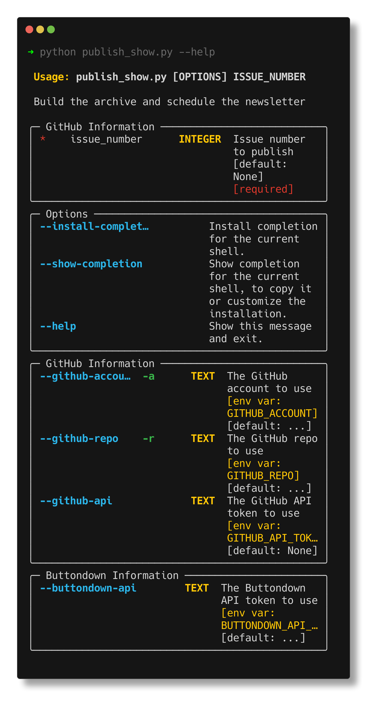

# Newsletter Automation - Python Community News

This project automates the process of creating a [newsletter for the Python Community News](https://buttondown.email/python-community-news). It uses the [buttondown](https://buttondown.email/) [API](https://api.buttondown.email) to create a newsletter and schedule it.

## Community Standards

This project adheres to the standards highlighted in the [organization repo](https://github.com/python-community-news/.github). You should be able to find the code of conduct, contributing guidelines, and other community standards in the **GitHub Interface** or the [organization repo](https://github.com/python-community-news/.github).

## Usage
### 1. Get a [buttondown](https://buttondown.email/) account and api key.

Visit the [buttondown](https://buttondown.email/) website and create an account. Once you have an account. Setup your newsletter. 
### 2. Create a template of this repo

There is a create template button on the top right of this repo. Click it and follow the instructions to create a template of this repo in your own account.

### 3. Clone the template

Clone the template to your local machine or cloud environment.

### 4. Create a virtual environment and install dependencies

```bash
python -m venv venv
source venv/bin/activate
python -m pip install -r requirements.txt
```

### 5. Store your api key in environment variables

You'll need some information to pass to the script. Most of the information can be passed as environment variables or manually.

#### Required Values
You will need the following information:

- `BUTTONDOWN_API_KEY` - Your buttondown api key. You can find this in your [buttondown](https://buttondown.email/) account settings.
- `GITHUB_ACCOUNT` - Your github account name. This is the name of the account that owns the repo you want to pull issues from.
- `GITHUB_REPO` - The name of the repo you want to pull issues from.

### Optional Values

- `GITHUB_API_TOKEN` - Your github api token. You can create one in your GitHub account settings in the Developer Settings section. If you have one, you can use it to increase the rate limit of the GitHub API. You can read more about the GitHub API rate limit [here](https://docs.github.com/en/rest/overview/resources-in-the-rest-api#rate-limiting).
    
Run the `publish_show.py` with the issue number

```bash
export BUTTONDOWN_API_KEY=<your_api_key>
export GITHUB_ACCOUNT=<your_github_account>
export GITHUB_REPO=<your_github_repo>
export GITHUB_API_TOKEN=<your_github_api_token>

python publish_show.py 1 # replace 1 with the issue number you want to publish

```

Alternatively, you can pass the values as arguments to the script.

```bash
python publish_show.py 1 \ 
--buttondown_api_key=<your_api_key> \ 
--github_account=<your_github_account> \
--github_repo=<your_github_repo> \
--github_api=<your_github_api_token>
```

You can also call the script with the `--help` flag to see all the options.

