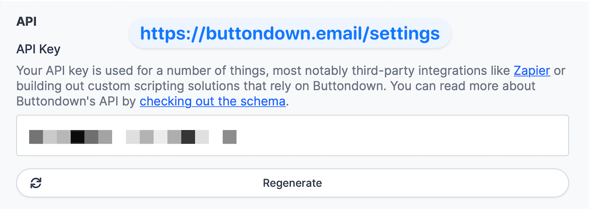

# Newsletter Automation - Python Community News

This project automates the process of creating a [newsletter for the Python Community News](https://buttondown.email/python-community-news). It uses the [buttondown](https://buttondown.email/) [API](https://api.buttondown.email) to create a newsletter and scheduled it.

## Community Standards

This project adheres to the standards highlighted in the [organization repo](https://github.com/python-community-news/.github). For more information on the Code of Conduct, License, Security, and Contributing information, please refer to the [organization repo](https://github.com/python-community-news/.github).

## To Use Yourself

### Get a [buttondown](https://buttondown.email/) account and api key.



### Create a template of this repo

There is a create template button on the top right of this repo. Click it and follow the instructions to create a template of this repo in your own account.

### Clone the template

Clone the template to your local machine or cloud environment.

### Create a virtual environment and install dependencies

```bash
python -m venv venv
source venv/bin/activate
python -m pip install -r requirements.txt
```

### Run the `publish_show` with the issue number

```bash
python publish_show.py --issue_number=1
```
